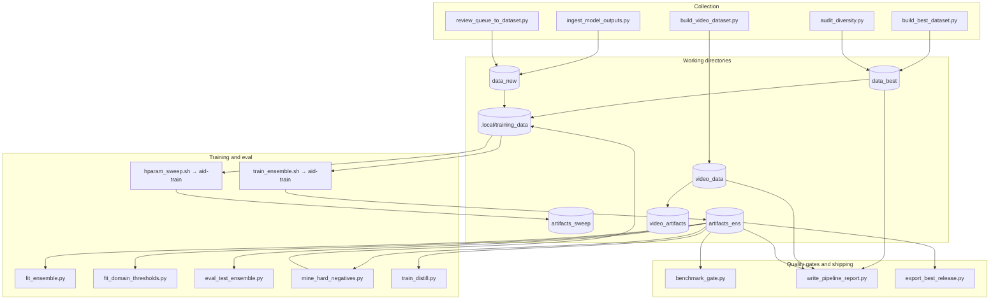

# Reference

This file keeps the README short and startup-focused while collecting the broader concepts in one place: the **local research pipeline** (data → train → evaluate → report), not a production serving stack.

## Documentation map

| Document | Use for |
|----------|---------|
| [STARTUP.md](STARTUP.md) | First-time setup: secure VM + Compose, native Linux, macOS, Windows |
| [COMMANDS.md](COMMANDS.md) | Day-to-day `./local.sh` and container commands |
| [REFERENCE.md](REFERENCE.md) | This file: layout, pipeline diagram, `scripts/*.py` roles, env vars, training options |
| [../SECURITY.md](../SECURITY.md) | Reporting vulnerabilities |

**Platform stance:** Linux (VM or bare metal) is the supported training path for CUDA and the full pipeline. macOS and Windows use Docker Compose (CPU `pipeline` service) or WSL2; native macOS Python is useful for **development and tests**, not for matching Linux+CUDA training.

## What This Repo Does

- runs a **local research pipeline**: collect and version data, prepare training sets, train image (and optional video) models, gate releases, and write reports
- collects image and video data locally (Hugging Face–centric, with safety bounds documented in [SECURITY.md](../SECURITY.md))
- trains local detectors (PyTorch; CUDA on Linux when available)
- supports resumable setup and pipeline runs (`./local.sh`, `scripts/do.sh`, Compose)
- stays in **training / research** mode; production serving is intentionally disabled
- targets a simple local CUDA + PyTorch workflow, especially on RTX 4090-class hardware

## Repo Layout

- `local.sh`: small public entrypoint
- `install.sh`: optional installer
- `docker-compose.yml`: optional Compose workflow for isolated CPU or GPU runs
- `Dockerfile`: CPU-oriented container image definition used by Compose
- `Dockerfile.gpu`: CUDA-enabled container image definition used by the GPU Compose service
- `docs/`: user-facing documentation
- `scripts/`: internal pipeline helpers and advanced wrappers
- `src/ai_image_detector/`: Python package code (includes `checkpoint_io` for staged checkpoint reads and `io_limits` for media/config bounds)
- Image training is intentionally split for reviewability: `train.py` (CLI entry), `train_main.py` (argument parser + loop), `train_support.py` (loss, EMA, eval helpers), `train_run_artifacts.py` (run config + dataset manifest), `train_post.py` (optional `test/` metrics + release bundle after training).
- `tests/`: regression coverage

## Architecture at a glance

| Layer | Role | Where |
|-------|------|--------|
| **Operator** | Stable command surface; wires venv + `PYTHONPATH` | **`./local.sh`** → **`scripts/do.sh`** for pipeline work (`collect`, `run`→`pipeline`, `train`→`train-existing`, `smoke`, `retrain`, `status`, …) |
| **Bootstrap** | Works before a full pipeline shell session | **`setup`**→`scripts/setup_linux.sh`, **`deps`**→`scripts/install_deps.sh`, **`docker-doctor`**→`scripts/doctor.sh` (**no** `do.sh` hop) |
| **Orchestration** | Stage functions, locks, shared env | **`scripts/lib/core.sh`**, **`collection.sh`**, **`training.sh`**; stage drivers like **`full_pipeline_4090.sh`**, **`smoke_resume_eval.sh`**, **`smoke_real_stack.sh`**, **`continuous_training.sh`** |
| **Drivers** | HF / dataset / reporting Python | **`scripts/*.py`** via **`run_repo_python`** |
| **Library** | Training, inference, limits, checkpoints | **`src/ai_image_detector/`** (`import ai_image_detector…`, **`python -m ai_image_detector.train`**, etc.) |

### Operator entrypoints vs pipeline scripts

Stage shell scripts are **not** a second public CLI for the same operations—call **`./local.sh …`** or **`bash scripts/do.sh …`** unless you are editing a stage. **Optional** packaging / IDE entrypoints (**`python -m ai_image_detector.train`**, **`video_temporal`**, **`ai_image_detector.cli`**) stay thin; use **`./local.sh deps`** when you need a **lock-matched** venv like CI.

### Python modules: `src/` vs `scripts/`

Two trees intentionally share one process:

| Location | Role |
|----------|------|
| **`src/ai_image_detector/`** | Installable library: training, inference, limits, checkpoints, metrics. Import as **`ai_image_detector.*`**. |
| **`scripts/*.py`** | Pipeline drivers and HF helpers (e.g. **`hf_data`**, **`build_best_dataset_sources`**). Not installed as top-level packages; they expect **`PYTHONPATH`** to include **`./src`** and **`./scripts`** (same as **`run_repo_python`** / **`./local.sh`**). |

**Do this:** run collection and training through **`./local.sh`**, **`bash scripts/do.sh …`**, or **`run_repo_python`** from **`scripts/lib/core.sh`** so imports resolve. **Avoid:** `python3 scripts/build_best_dataset.py` from a random directory without that **`PYTHONPATH`** — imports will fail or pick the wrong tree. For library-only work, use **`python -m ai_image_detector.train`** (or tests) with the venv that **`./local.sh setup`** created.

## Public commands

Use [COMMANDS.md](COMMANDS.md) for the `./local.sh` command map and stage descriptions. Everything under `scripts/` and `src/ai_image_detector/` exists to support that surface.

## Current pipeline shape

The current pipeline is:

1. preferred path: run inside a dedicated Linux VM with Docker Compose and the isolated container venv at `/opt/aid-venv`
2. native fallback: `./local.sh setup` creates or reuses `./.venv`
3. collect and curate image data into `./data_best`
4. collect video data into `./video_data`
5. ingest or preserve incremental image data under `./data_new`
6. prepare additive image training data in `./.local/training_data`
7. train image models, and optionally video models when complete video data exists
8. persist resumable state, collection manifests, and stage markers under `./.local`

This means the repo is no longer just “run one train script on one folder.” It is a local dataset-building and retraining workflow with resumability and incremental refresh support.

## Pipeline architecture (data flow)

High-level flow from collection through training to release artifacts (names match on-disk dirs):



Orchestration is normally **`scripts/full_pipeline_4090.sh`** (full run) or **`scripts/do.sh`** / **`./local.sh`** (operator commands). **`scripts/smoke_resume_eval.sh`** exercises a minimal path with synthetic data.

Robustness evaluation is run as **`repo_python -m ai_image_detector.robust_eval`** from `full_pipeline_4090.sh` (library module, not a `scripts/*.py` file).

### Shell helpers (`scripts/lib/core.sh`)

Pipeline scripts use:

- **`repo_python`** — runs the repo venv’s Python with **`PYTHONPATH`** including **`./src`** and **`./scripts`** (same import paths as training).
- **`run_repo_python`** — same as **`repo_python`**, but calls **`ensure_env`** first so the venv exists or dependency install runs when appropriate.
- **`run_repo_python_with_timeout`** — like **`run_repo_python`**, but wraps the interpreter with **`timeout`** when available; **`PYTHONPATH`** matches **`run_repo_python`**.
- **`ensure_env`** — in **`DRY_RUN=1`**, dry-run lines are written to **stderr** so **stdout** stays clean for structured output and command substitutions.

Collection gates such as **`require_pipeline_collection_data`** (in **`scripts/lib/training.sh`**) run at the start of **`./local.sh train`** / **`train-existing`** and use **`run_repo_python`** when reading **`dataset_build_report.json`** so the parse uses the same environment as the rest of the pipeline.

## `scripts/*.py` inventory

All of these live under `scripts/` (repo root on `PYTHONPATH` when invoked via `repo_python` / `bash scripts/...`). Nothing listed as **internal** should be treated as a stable public CLI; call it only through the supported shell entrypoints or imports from other repo scripts.

| Script | Role |
|--------|------|
| `build_best_dataset.py` | **Operator**: image dataset build (HF discovery, streaming, splits). Used by `full_pipeline_4090.sh`, `scripts/lib/collection.sh`, `smoke_real_stack.sh`. |
| `build_video_dataset.py` | **Operator**: video dataset pull/normalize. Used by `full_pipeline_4090.sh`, `collection.sh`. |
| `prepare_training_data.py` | **Operator**: merge base + incremental → training-ready tree. Used by `full_pipeline_4090.sh`, `training.sh`, `smoke_resume_eval.sh`. |
| `ingest_model_outputs.py` | **Operator**: ingest incoming model outputs → `data_new`. Used by `collection.sh`. |
| `audit_diversity.py` | **Operator**: diversity audit after diverse collection profile. Used by `collection.sh`. |
| `review_queue_to_dataset.py` | **Operator**: review queue → incremental train data. Used by `training.sh`. |
| `fit_ensemble.py` | **Operator**: stack calibrator / ensemble weights. Used by `full_pipeline_4090.sh`, `smoke_resume_eval.sh`. |
| `fit_domain_thresholds.py` | **Operator**: per-domain thresholds. Used by `full_pipeline_4090.sh`, `smoke_resume_eval.sh`. |
| `eval_test_ensemble.py` | **Operator**: test-set metrics for ensemble. Used by `full_pipeline_4090.sh`, `smoke_resume_eval.sh`. |
| `mine_hard_negatives.py` | **Operator**: hard-negative mining. Used by `full_pipeline_4090.sh`. |
| `train_distill.py` | **Operator**: student distillation. Used by `full_pipeline_4090.sh`. |
| `write_pipeline_report.py` | **Operator**: dataset QA / final / failure reports. Used by `full_pipeline_4090.sh`, `smoke_resume_eval.sh`. |
| `export_best_release.py` | **Operator**: release bundle under `artifacts_ens/release`. Used by `full_pipeline_4090.sh`, `smoke_resume_eval.sh`. |
| `benchmark_gate.py` | **Operator**: threshold gate on metrics. Used by `training.sh`, `smoke_resume_eval.sh`. |
| `build_target_dataset.py` | **Manual**: targeted HF dataset build from a `TargetSpec` (not wired to `./local.sh`; tests + offline use). |
| `extract_recent_training_spec.py` | **Manual**: summarize incremental data and emit LLM prompts for target specs (offline helper). |
| `deps_profile.py` | **Operator**: resolve/validate `DEPS_EXTRA` profiles for install/doctor. Used by `install_deps.sh`, `doctor.sh`. |
| `update_deps_lock.py` | **Operator**: regenerate/verify `requirements.lock*`. Used by CI and `scripts/update_deps_lock.sh`. |
| `lib/install_validate.py` | **Operator**: validate install rev/dir before clone. Used by `install.sh`. |
| `hf_data.py` | **Internal**: HF downloads, cache helpers, manifests. Imported by dataset builders. |
| `dataset_builder_common.py` | **Internal**: shared HF env and target counting. Imported by image/video builders. |
| `build_best_dataset_policy.py` | **Internal**: policy knobs for `build_best_dataset`. |
| `build_best_dataset_support.py` | **Internal**: acceptance loop and summaries for `build_best_dataset`. |
| `build_best_dataset_sources.py` | **Internal**: source lists and HF discovery. Imported by `build_best_dataset.py`. |
| `image_materialize.py` | **Internal**: image materialization / dedup helpers. Imported by `build_best_dataset.py`. |
| `script_support.py` | **Internal**: JSON, git, checkpoint paths for scripts. Imported by reporting/export/benchmark scripts. |
| `release_selection.py` | **Internal**: model selection and manifest pieces. Imported by `export_best_release.py`, `write_pipeline_report.py`, `benchmark_gate.py`. |

Image member training uses **`aid-train`** from `scripts/train_ensemble.sh` and `scripts/hparam_sweep.sh` (repo venv wrapper, not a `scripts/*.py` driver). Video training uses **`aid-video-train`** from `full_pipeline_4090.sh`.

## Dataset and artifact basics

Typical image dataset layout:

```text
data/
  train/
    real/
    ai/
  val/
    real/
    ai/
  test/
    real/
    ai/
```

For **`./data_best`**, when **`dataset_build_report.json`** is present and reports **`full_targets_ok`**, **`require_pipeline_collection_data`** skips minimum per-class image counts unless you set explicit **`PIPELINE_MIN_*`** / **`TRAIN_PER_CLASS`** minima (see **`scripts/lib/training.sh`**).

Typical video dataset layout:

```text
video_data/
  train/
    real/
    ai/
  val/
    real/
    ai/
```

Image training writes artifacts such as:
- `best.safetensors`
- `best_checkpoint.txt`
- `last.pt`
- `epoch_XXX.pt`
- `best_metrics.json`
- `test_metrics.json`
- `calibration.json`
- `best_model_summary.json`
- `config.json`
- `training_log.jsonl`

Video training writes artifacts such as:
- `best_video.safetensors`
- `last_video.pt`
- `epoch_video_XXX.pt`

Pipeline-level reports also include:
- `domain_config.json`
- `robust_eval.json`
- `final_run_summary.json`
- `final_thresholds.json`
- `run_manifest.json`
- `prod_manifest.json`
- `release/release_manifest.json`

Canonical release bundle:
- `./artifacts_ens/release/`
  Exported bundle for sharing, with the best checkpoints and the main eval/calibration sidecars in one directory.

## Pipeline tools

The packaged CLI surface is intentionally small:

```bash
aid-train
aid-video-train
```

Those commands exist to support the local pipeline scripts, not to turn this repo into a broad general-purpose app surface.
The repo bootstrap installs them as lightweight wrappers in `./.venv/bin` around the Python modules in this package. After `./local.sh deps`, the matching runtime extras in `pyproject.toml` should satisfy imports; if not, the CLI prints an absolute repo-root `./local.sh deps` recovery command on stderr.

## Python dependencies

**Version numbers:** treat repo-root **`requirements.lock`** and **`requirements.lock.json`** as authoritative. **This documentation does not pin or mirror package versions**; it only describes mechanics.

The codebase uses **Python 3.11+** syntax (for example `str | None` unions). `requires-python` in `pyproject.toml` matches that.

**`pyproject.toml`** — **`[project.optional-dependencies]`** lists **minimum** (`>=`) versions per extra (`pipeline`, `training`, `collection`, `video`, `inference`). **`requirements.lock`** pins **exact** releases for the default **pipeline** profile used by **`scripts/update_deps_lock.py`** / **`./local.sh deps`**. **`requirements.lock.json`** stores the chosen filename, URL, and **PyPI SHA256** for each pin. Regenerate with **`bash scripts/update_deps_lock.sh`**, verify with **`python3 scripts/update_deps_lock.py verify --require-current`**, commit both files; CI **Security Checks** re-fetches PyPI metadata and compares digests.

**Resolver behavior:** for each dependency the updater picks the **latest stable** release on PyPI compatible with `requires-python` (**prereleases skipped**). It does **not** cap below what PyPI publishes. **torch** and **torchvision** are kept on a matching stable series via **`TORCHVISION_SERIES_BY_TORCH_SERIES`** in **`scripts/update_deps_lock.py`**; when PyTorch ships a new stable torch minor, that map must gain an entry before the lock refresh can follow it. For **manylinux x86_64** wheels with several `cp*` tags, the script records the newest tag up to **`MANIFEST_MAX_WHEEL_CP`** (must match **`.github/ci-python-version.txt`** for CI wheel picks); bump both when CI moves to a newer interpreter.

Default extra for the full training/collection stack is **`pipeline`**. Manual editable install (resolver-only, may differ from the lock until you re-sync):

```bash
pip install -e '.[pipeline]'
```

Normal native usage should still go through **`./local.sh deps`** or **`./local.sh setup`**, which install the repo-managed environment and wrapper commands into **`./.venv`** from **`requirements.lock`**.

## Containerized path

For the preferred more isolated runtime, the repo includes:

```bash
docker compose run --rm pipeline ./local.sh doctor
docker compose run --rm pipeline-gpu ./local.sh doctor
docker compose run --rm pipeline-gpu ./local.sh run
```

The Compose services:
- bind-mount the repo at `/workspace`
- auto-read `HF_TOKEN` from the repo `.env`
- keep Hugging Face and pip caches under `./.local` and in named Docker volumes
- drop Linux capabilities and enable `no-new-privileges`
- keep the repo checkout writable and use `tmpfs` scratch space
- apply a PID limit to reduce blast radius if a process misbehaves

GPU mode requires Docker Engine, the Docker Compose plugin, and the NVIDIA Container Toolkit inside the dedicated Linux VM.
The intended secure model is: host -> dedicated Linux VM -> Docker Engine -> Compose containers.
Docker Desktop's lightweight Linux VM or WSL2-backed microVM-style boundary is appropriate for CPU `pipeline` checks on macOS and Windows, but it does not replace the dedicated Linux VM + `pipeline-gpu` path for production-like CUDA training.

## Pipeline entrypoints

Normal users should start with the Linux VM + Docker Compose path:

```bash
docker compose run --rm pipeline ./local.sh deps
docker compose run --rm pipeline-gpu ./local.sh smoke
docker compose run --rm pipeline-gpu ./local.sh run
```

For native fallback Linux usage:

```bash
./local.sh setup
./local.sh collect
./local.sh collect-status
./local.sh train
./local.sh retrain
./local.sh continuous
```

For command-level control, use:

```bash
bash scripts/do.sh pipeline
bash scripts/do.sh train-existing
```

For deeper command coverage, see [COMMANDS.md](COMMANDS.md).

## Performance-oriented paths

There is a single full pipeline script: `scripts/full_pipeline_4090.sh`.

- Default (`PIPELINE_PROFILE` unset or `standard`): lighter defaults for direct runs and custom overrides.
- Quality-first (`PIPELINE_PROFILE=max_quality`): the profile used by `./local.sh run` and the training helpers in `scripts/lib/training.sh`.

```bash
PIPELINE_PROFILE=max_quality bash scripts/full_pipeline_4090.sh
```

Example override on the standard profile:

```bash
DATA_DIR=./data_best EPOCHS=14 SKIP_SWEEP=1 bash scripts/full_pipeline_4090.sh
```

## Setup and `doctor` (native Linux)

| Variable | Default | Purpose |
|----------|---------|---------|
| `SETUP_DOCTOR_MIN_FREE_GB` | `0` | During `./local.sh setup`, forwarded as `DOCTOR_MIN_FREE_GB` so bootstrap succeeds on smaller disks. Set higher if you want setup-time disk enforcement. |
| `DOCTOR_MIN_FREE_GB` | `40` | `scripts/doctor.sh` requires at least this many GiB free under the repo root (unless lowered by setup as above). |

## Environment variables (`AID_*`)

Bounds and toggles are intentionally env-driven so containers and CI can tune without code edits.

| Variable | Default (typical) | Purpose |
|----------|-------------------|---------|
| `AID_MAX_IMAGE_FILE_BYTES` | 50 MiB | Max image file size for opens / hashing |
| `AID_MAX_IMAGE_PIXELS` | ~9500² | PIL decompression cap (zip-bomb mitigation) |
| `AID_MAX_EXIF_BYTES` | 256 KiB | EXIF read cap |
| `AID_MAX_PROVENANCE_SCAN_BYTES` | 512 KiB | Provenance header scan |
| `AID_MAX_JSON_CONFIG_BYTES` | 2 MiB | Ensemble / domain / tools JSON cap |
| `AID_MAX_VIDEO_FILE_BYTES` | 2 GiB | Video file size before decode |
| `AID_MAX_VIDEO_DECODE_FRAMES` | 500000 | Video frame decode budget |
| `AID_MAX_SAFETENSORS_METADATA_BYTES` | 256 KiB | Checkpoint metadata JSON cap |
| `AID_MAX_SAFETENSORS_FILE_BYTES` | 2 GiB | `.safetensors` checkpoint file size cap before load |
| `AID_MAX_TRAINING_CHECKPOINT_BYTES` | 2 GiB | `.pt` training checkpoint load cap |
| `AID_HF_TRUST_REMOTE_CODE` | unset | Set to `1`/`true`/`yes` with **`AID_HF_TRUST_REMOTE_ALLOWLIST`** and **`AID_ACCEPT_HF_TRUST_REMOTE_RISK`** (or **`I_ACCEPT_HF_TRUST_RISK`**) before allowlisted **`org/dataset`** ids use Hub **`trust_remote_code=True`** |
| `AID_HF_TRUST_REMOTE_ALLOWLIST` | unset | Comma-separated Hugging Face dataset ids evaluated when **`AID_HF_TRUST_REMOTE_CODE=1`** and accept flags are set |
| `AID_HF_TRUST_REMOTE_UNSAFE_GLOBAL` | unset | With **`AID_HF_TRUST_REMOTE_CODE=1`** and accept flags, set to `1`/`true`/`yes` for legacy global **`trust_remote_code`** on every dataset (not recommended) |
| `AID_ACCEPT_HF_TRUST_REMOTE_RISK` | unset | Set to `1`/`true`/`yes` (or **`I_ACCEPT_HF_TRUST_RISK`**) before any Hub **`trust_remote_code=True`** path (allowlist or global) |
| `AID_WORKSPACE_ROOT` | process **`cwd`** | Collection and ingest paths must resolve under this directory; Docker Compose sets **`/workspace`** |
| `AID_CHECKPOINT_LOAD_STAGING` | `1` | Implemented in `checkpoint_io.py`. Set to `0`/`false`/`no`/`off` to load checkpoints in place (skips `O_NOFOLLOW` + temp copy; faster, weaker TOCTOU defense) |
| `AID_SKIP_DATA_PREFLIGHT` | unset | Set to `1`/`true`/`yes` to skip dataset symlink preflight (tests only; not recommended for real training) |

## Install-time environment variables (`install.sh`)

| Variable | Default | Purpose |
|----------|---------|---------|
| `REPO_URL` | official `https://github.com/Legendarylibrorg/ai-image-video-detector.git` | Git remote URL for a fresh clone (HTTPS only when custom) |
| `INSTALL_DIR` | `$PWD/ai-image-video-detector` | Target directory when the installer clones or reuses a tree |
| `INSTALL_REV` | unset | Optional tag or branch name for **`git clone --depth 1 --branch`** (pin the moving default branch); stderr notice when unset |
| `INSTALL_ALLOW_CUSTOM_REPO` | `0` | Set to `1` to clone non-default `REPO_URL` values |
| `INSTALL_ALLOW_NON_OFFICIAL_GITHUB_REPO` | unset | Set to `1` when `REPO_URL` is a GitHub fork or non-canonical `org/repo` under `github.com` |
| `INSTALL_REPO_HOST_ALLOWLIST` | `github.com` (via `install_validate.py` when env unset) | Comma-separated HTTPS hostnames allowed when `INSTALL_ALLOW_CUSTOM_REPO=1`; must be non-empty unless `INSTALL_ALLOW_ANY_HTTPS_HOST=1` |
| `INSTALL_ALLOW_ANY_HTTPS_HOST` | unset | Set to `1` to skip hostname allowlisting (not recommended) |

## `aid-train` dataset integrity flags

These complement `AID_SKIP_DATA_PREFLIGHT` and the preflight in `dataset_integrity.py`:

- **`--strict-dataset`** — Hash every train and validation image; abort if the same SHA-256 appears in both splits (content leakage).
- **`--dataset-manifest`** — `standard` (default): hashed val + train path metadata; `full`: hash train too; `off`: skip manifest file.
- **`--skip-data-preflight`** — Skip symlink checks (prefer env `AID_SKIP_DATA_PREFLIGHT` in automation if you must).

With `--strict-dataset` and `--dataset-manifest off`, overlap is still enforced but `dataset_manifest.json` is not written.

## Modern training stack (`aid-train`)

The trainer targets **current PyTorch practice** without pulling extra services or web UIs:

- **Device order:** CUDA, then **Apple MPS** (Metal), then CPU via `training_device()` (shared with `infer` / `robust_eval`).
- **AMP:** `torch.amp` autocast + GradScaler on CUDA (bf16/fp16 friendly); MPS/CPU train in full precision unless PyTorch adds first-class MPS AMP.
- **Optimization:** Fused **AdamW** on CUDA when supported; **TF32** matmul + cuDNN benchmark when not in deterministic mode.
- **Regularization:** Mixup, label smoothing, EMA shadow weights for validation and exported weights.
- **Schedule:** Cosine annealing; optional **`--warmup-epochs`** linear warmup (common for ConvNeXt / large backbones).
- **Compilation:** optional `torch.compile` (default on in CLI; failures fall back gracefully).
- **Backbones:** includes **ConvNeXt-Small** (`--backbone convnext_small`) with ImageNet-1K weights for stronger capacity than Tiny while keeping the same multi-branch FFT + residual design.

## Related docs

- [STARTUP.md](STARTUP.md)
- [COMMANDS.md](COMMANDS.md)
- [../SECURITY.md](../SECURITY.md)
